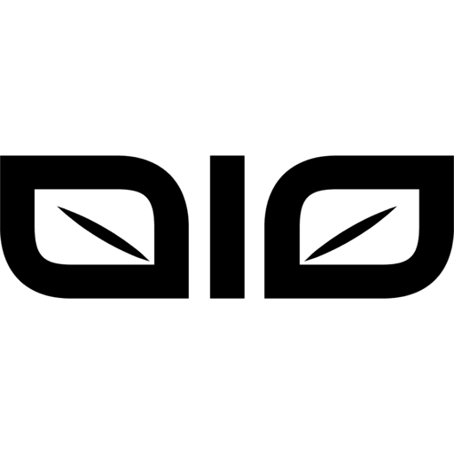

# NVyro

> Central hub for all of our organisational documentation

## Aims

Assisting in improving, and standardising, the current way we automate and
track the progress of our beloved plants.

With N-Vyro.io you'll be able to create your ideal environmental settings
without worrying how everything communicates with each other.

We also make it easier to integrate existing equipment into your environment
providing enhanced functionality which has previously been missing.

### What We Are Not

 * An Island
 * Profit driven
 * Concerned with titles
 * Looking for Investors

### What We Are

 * Data Driven
 * Community Lead
 * Collaborative
 * Innovative
 * Transparent
 * Looking for active members

## Values

 **Community Centric**: We're a small at the moment but our aim is to grow into a stable, well established group, who
can then fully transition into a workers co-op once we've established all of the processes such a community driven
entity requires.

 **Tech for Good**: We believe that technology can help everyone. So our goal is to provide a system that can be used
 and improved upone regardless of your class and environment.

 **Strive to work efficiently**: We've spent most of our lives working in broken corperate environments. So we've
 learnt how to counter this and we act upon this in all aspects of our business.

 **Self Sustainability**: Consumerism has encouraged people to throw things away for the new. We not only encourage
 you to upgrade and make changes without a free we endeavour to only release new products when it's because the
 community ask for it.

 **Simplicity**: There's many way to automate your grow, and some of these are really cool. But we want people to
 being able to use these kinds of tech without having to be IT geeks.

 **Equity**: We believe that everyone has value and we aim to not only help them actualise this but to also encourage
 other to do the same. We also strive to make our products available to as many people as possible, regardless of
 their privilege, or lack there of.

 **Collaboration**: We firmly believe that for things to improve you have to work together. Not only when it comes to
 internal business but we're proving our community with products that they've asked for and we aim to work closely
 with our community to enrich their lives.

 **Transparency**: As with all companies, we feel that we have somthing that can really help others, and the world.
 but unlike other companies we strive to keep as much of our practices in the open.

 **Composability**: Not only do we value use them an engineer perspective but we also find it vital in how we work and
 organise.

## Mission

n-vyro.io's mission is to provide a more sustainable, and reliable, way for people to grow regardless of the area they
reside within.

Aims:
 * Give users control of their environments
 * Standardise how people setup growing environments
 * Make growing more accessible to the wider public
 * Simplify smart devices

Core Principles:
 * Tech for Good
 * Collaboration
 * Equity
 * Transparency

Roadmaps
 * Test physical devices
  * Resolve any issues that crop up
  * Enhance documentation based off feedback
 * Complete marketing
  * Competitor analysis
  * Focus on target community
 * Market and build community

Future Goals
 * Place artifical intelligence in the hands of users
 * Provide a common communication layer for all growing peripherals
 * Path the way for similar kinds of co-ops
 * Extend this into Standardisation into other sector
  * Ensuring the standard remains in the hands of the public

## Terminology

 * **NVyroConnect**: Device for connecting any 12/24v peripherals to (ie. growing lights, fans, irrigation)
 * **NVyroSense**: Devices that are used to track and enviroment on it's soil
 * **NVyroHub**: Main interface user users for controlling events and how their gardens are setup
 * **NVyroSoil**: A device for tracking the environment, and the soil it's placed in.
 * **NVyroZone**: A device for tracking the environment in an area

## Contributing

We welcome contributors of all kinds, whether it's making documentational changes or adding a new feature. There a are
few steps to take into consideration but for the most part the process isn't that much different from contributing to
any other codebase.

Ways of contributing:

* Product improvements
* Product testing
* Documentation Improvements
* Bug Reporting

### Product improvements

#### Marketing

#### Product

#### Development

We have a relatively stable foundation to work from, but it is by no means perfect. We'd love for other with a passion
for collaboration, programming, growing, and automation, to help us make n-vyro.io the product that we'd all love.

Ideally we're open to anyone who has production level experienced with the following languages:

 * Ruby
 * C/C++
 * Golang
 * ES2016+
 * VueJS
 * Arduino/ESP8266/ESP32

They'll need to be comfortable with the TDD/BDD approaches of development, with a strong background in writing well
documentated code, but also be extremely pragmatic and have a nature desire to want to challenge ideas and not egos.

### Product testing
### Documentation Improvements
### Bug Reporting

### Contributing

* [Development](./docs/contributing/development)
* [Guidelines](./docs/contributing/guidelines.md)

### Community

 * [Guidelines](./docs/community/guidelines.md)

## When are we ready to become a full workers co-op

We'll need to make sure we've implemented these steps before we can perceive ourselves as a mature organisation

steps to a mature organisation:
* shared vision
* accountability
* governance
* shared identity
* a decision-making protocol
* oh yeah, a sustainable business model would be nice

## Notes

* [Meetings](./docs/notes/meetings/README.md)
* [Releases](./docs/notes/releases/README.md)
* [Roadmaps](./docs/notes/roadmaps/README.md)

## Contributing to NVyroHub

See [Code of Conduct](CODE_OF_CONDUCT.md) &amp; [Contributing](CONTRIBUTING.md) for more information

## Copyright

Copyright (C) 2019-2021 n-vyro.io LLC

This Software License Agreement (the “Agreement”) is between n-vyro.io LLC (“n-vyro.io”) and You (including your
agents and affiliates), a commercial licensee of n-vyro.io's software. If you have not purchased a n-vyro-api
commercial license from n-vyro.io, these terms do not apply to you, and your use of the n-vyro.io software is
instead governed by the GNU General Public License, version 3.

See LICENSE.txt for further details.
